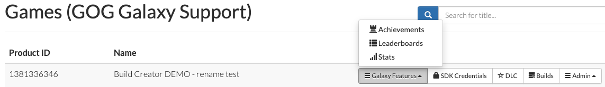
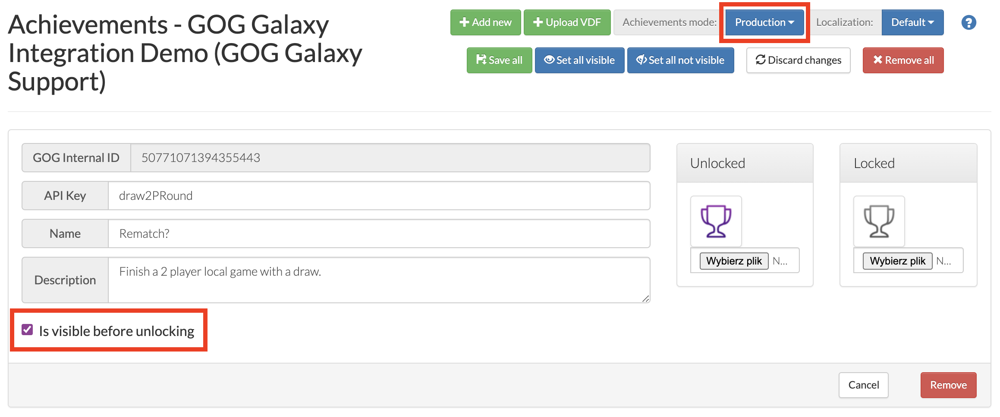

# Statistics and Achievements

The GOG GALAXY SDK allows to store information about **statistic** and **achievements** using the [`IStats`](https://docs.gog.com/galaxyapi/classgalaxy_1_1api_1_1IStats.html) interface.

Before working with achievements, you must define them in the  [Developer Portal](https://devportal.gog.com/welcome). To add achievements, go to [Games](https://devportal.gog.com/panel/games), click the *Galaxy Features* button for a game and select *Achievements* from the resulting list:

Alternatively, if you have all achievements already deployed on Steam, you can import them to GOG Developer Portal by following this [guide](sdk-steam-import.md).

!!! Important
    When working with GOG GALAXY stats or/and achievements, please remember to have them retrieved first with [`RequestUserStatsAndAchievements()`](https://docs.gog.com/galaxyapi/classgalaxy_1_1api_1_1IStats.html#a38f5c146772f06dfd58c21ca599d7c25), and that you have to call the [`StoreStatsAndAchievements()`](https://docs.gog.com/galaxyapi/classgalaxy_1_1api_1_1IStats.html#a0e7f8f26b1825f6ccfb4dc26482b97ee) function after changing a statistic value or achievement state to make this change persistent (see the section below).

## Setting a User Achievement/Statistic

To unlock an achievement or change a statistic value, you need three methods:

1. [`IStats::RequestUserStatsAndAchievements()`](https://docs.gog.com/galaxyapi/classgalaxy_1_1api_1_1IStats.html#a38f5c146772f06dfd58c21ca599d7c25) — to retrieve user’s statistics and achievements.
2. [`IStats::SetAchievement()`](https://docs.gog.com/galaxyapi/classgalaxy_1_1api_1_1IStats.html#aa5f8d8f187ae0870b3a6cb7dd5ab60e5) or `IStats::`[`SetStatFloat()`](https://docs.gog.com/galaxyapi/classgalaxy_1_1api_1_1IStats.html#ab6e6c0a170b7ffcab82f1718df355814)/[`SetStatInt()`](https://docs.gog.com/galaxyapi/classgalaxy_1_1api_1_1IStats.html#adefd43488e071c40dc508d38284a1074) — to unlock achievements and set statistics values, respectively. Achievement name provided as an argument to the `SetAchievement()` function is the same as the one specified in the *“API_KEY”* field in the Developer Portal.
3. [`IStats::StoreStatsAndAchievements()`](https://docs.gog.com/galaxyapi/classgalaxy_1_1api_1_1IStats.html#a0e7f8f26b1825f6ccfb4dc26482b97ee) — this method pushes information about unlocked achievements and changed stats to the GOG GALAXY backends.

Before calling the `Set` or `Store` methods, please remember to wait until success response comes from `RequestUserStatsAndAchievements()` to [`UserStatsAndAchievementsRetrieveListener`](https://docs.gog.com/galaxyapi/classgalaxy_1_1api_1_1IUserStatsAndAchievementsRetrieveListener.html).

## Offline Achievements and Statistics

Offline achievements/statistics will work automatically in the same way as they do in an online mode. If achievements are implemented properly, they will be unlockable even when the user is offline, but **was signed in to Galaxy client before losing Internet connection**. After unlocking an achievement, the notification about this event will be shown (if the Galaxy Overlay is turned on) and statuses of achievements and new values of statistics will be aggregated in order to synchronize them with the GOG GALAXY backends as soon as the user is back online.

!!! Important
    Please remember that [`IsLoggedOn()`](https://docs.gog.com/galaxyapi/classgalaxy_1_1api_1_1IUser.html#a3e373012e77fd2baf915062d9e0c05b3) (which gives info about the connection to the Galaxy backend) returns `True` for an online mode and `False` for an offline mode, so you shouldn’t disable Achievements and Statistics features based on this status.

## Achievements Modes

When the achievements mode is set to *Production* in the Developer Portal, all achievements are visible to end users. Achievements without the flag *“Is visible before unlocking”* turned on will show up as a *“Secret Achievement”* in the GOG GALAXY client.

In the *Development* mode, no achievements are displayed in the GOG GALAXY client and only appear when a user fulfils the unlock criteria for them in an SDK-integrated build. This allows you to work on your achievements without end users seeing them. **Please note that achievements will always be visible if they are unlocked.**

## Clearing Achievements

During development, you might be interested in clearing achievements progress for testing purposes. In order to reset achievements state, you can call the [`ClearAchievement()`](https://docs.gog.com/galaxyapi/classgalaxy_1_1api_1_1IStats.html#adef56fea6b98328144d7c61b69233b68) function, passing an API key of an achievement as the argument. Please remember that first you have to retrieve achievements with the  [`RequestUserStatsAndAchievements()`](https://docs.gog.com/galaxyapi/classgalaxy_1_1api_1_1IStats.html#a38f5c146772f06dfd58c21ca599d7c25) function and call the [`StoreStatsAndAchievements()`](https://docs.gog.com/galaxyapi/classgalaxy_1_1api_1_1IStats.html#a0e7f8f26b1825f6ccfb4dc26482b97ee) function after clearing an achievement to make this change persistent.

## Setting Up Achievements Does Not Work — What Should I Do?

- Have you called [`RequestUserStatsAndAchievements()`](https://docs.gog.com/galaxyapi/classgalaxy_1_1api_1_1IStats.html#a38f5c146772f06dfd58c21ca599d7c25) and waited for a callback to its listener before calling any other achievement methods?
- Have you called [`StoreStatsAndAchievements()`](https://docs.gog.com/galaxyapi/classgalaxy_1_1api_1_1IStats.html#a0e7f8f26b1825f6ccfb4dc26482b97ee) after calling [`SetAchievement()`](https://docs.gog.com/galaxyapi/classgalaxy_1_1api_1_1IStats.html#aa5f8d8f187ae0870b3a6cb7dd5ab60e5) to commit the changes?
- Are you calling [`ProcessData()`](https://docs.gog.com/galaxyapi/group__Peer.html#ga1e437567d7fb43c9845809b22c567ca7) frequently enough?
- Have you set up appropriate listeners properly?
- Have you set up error handling? It is possible to catch errors within the Galaxy SDK methods or use the [`GetError()`](https://docs.gog.com/galaxyapi/group__api.html#ga11169dd939f560d09704770a1ba4612b) method to check if any errors occurred.

For more information about Achievements and their related GOG GALAXY SDK methods, please visit the [GOG GALAXY SDK API documentation](https://docs.gog.com/galaxyapi).