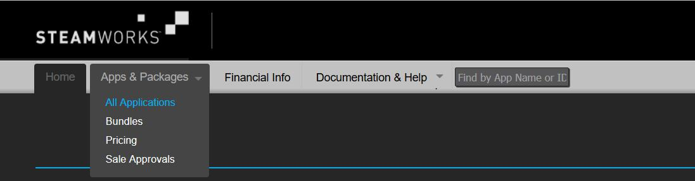
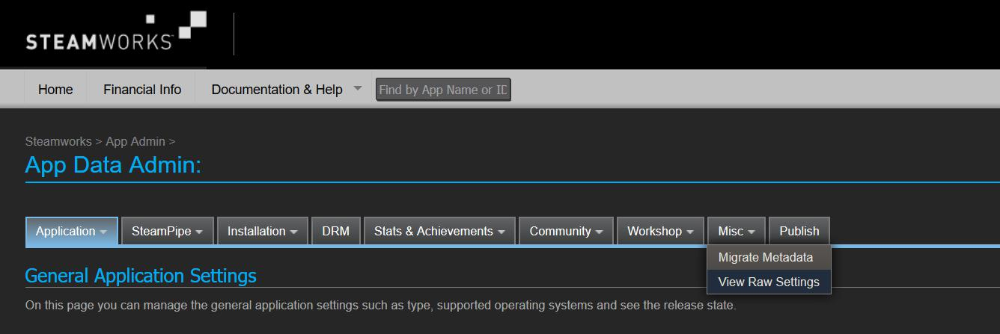
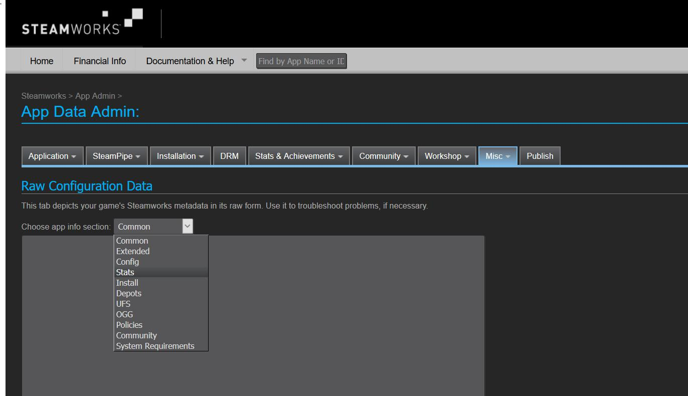

# Importing Achievements Using the Steam VDF File

To generate the file containing achievement information, including localized data, please do the following:

1. Go to https://partner.steamgames.com/.

2. Log in to the system.

3. Go to *Apps & Packages→All Applications*.

    

4. Select the *Steamworks Admin* option for your game.

5. Go to *Misc→View Raw Settings* option.

    

6. In the *Raw Configuration Data* section, you’ll see an option to *Choose app info section*: select *Stats* from the drop-down menu.

    

7. Copy all the presented information to a text editing program, such as Notepad or Notepad++, and save the data as a .txt file.

    !!! Important
        Make sure to encode your .txt or .vdf as UTF-8 when saving; this ensures special characters, and characters not featured in the English language are correctly saved and imported.

8. With the .txt file ready, log in to the [GOG Developer Portal](https://devportal.gog.com/) and click *Games* in the main menu.

9. On the resulting [Games](developer-portal.md#games-screen-product-buttons) screen, click the *Galaxy Features* button for the game you want to import Steam achievements to, then select Achievements from the displayed menu. The [Achievements](achievements.md) screen will appear.

10. Follow the steps outlined in [*Adding Achievements Imported From Steam*](achievements.md#adding-achievements-imported-from-steam) to import the data from the .txt file to the Developer Portal.

## Example
In general if you followed instructions closely then contents of the VDF file should look similar to this:
```
"353252341"
{
    "stats"
    {
        "1"
        {
            "bits"
            {
                "0"
                {
                    "name" "FAKE_ACHIEVEMENT_1"
                    "display"
                    {
                        "name"
                        {
                            "english" "Fake achievement name 1"
                            "polish" "Testowe osiagniecie 1"
                        }
                        "desc"
                        {
                            "english" "Fake achievement description 1"
                            "polish" "Opis testowego osiagniecia 1"
                        }
                        "hidden" "1"
                        "icon" "/img/unlocked.jpg"
                        "icon_gray" "/img/locked.jpg"
                    }
                }
                "1"
                {
                    "name" "FAKE_ACHIEVEMENT_2"
                    "display"
                    {
                        "name"
                        {
                            "english" "Fake achievement name 2"
                            "polish "Testowe osiagniecie 2"
                        }
                        "desc"
                        {
                            "english" "Fake achievement description 2"
                            "polish" "Opis testowego osiagniecia 2"
                        }
                        "hidden" "0"
                        "icon" "/img/unlocked.jpg"
                        "icon_gray" "/img/locked.jpg"
                    }
                }
                "2"
                {
                    "name" "FAKE_ACHIEVEMENT_3"
                    "display"
                    {
                        "name"
                        {
                            "english" "Fake achievement name 3"
                            "polish" "Testowe osiagniecie 3"
                        }
                        "desc"
                        {
                            "english" "Fake achievement description 3"
                            "polish" "Opis testowego osiagniecia 3"
                        }
                        "hidden" "1"
                        "icon" "/img/unlocked.jpg"
                        "icon_gray" "/img/locked.jpg"
                    }
                }
                "3"
                {
                    "name" "FAKE_ACHIEVEMENT_4"
                    "display"
                    {
                        "name"
                        {
                            "english" "Fake achievement name 4"
                            "polish" "Testowe osiagniecie 4"
                        }
                        "desc"
                        {
                            "english" "Fake achievement description 4"
                            "polish" "Opis testowego osiagniecia 4"
                        }
                        "hidden" "0"
                        "icon" "/img/unlocked.jpg"
                        "icon_gray" "/img/locked.jpg"
                    }
                }
                "4"
                {
                    "name" "FAKE_ACHIEVEMENT_5"
                    "display"
                    {
                        "name"
                        {
                            "english" "Fake achievement name 5"
                            "polish" "Testowe osiagniecie 5"
                        }
                        "desc"
                        {
                            "english" "Fake achievement description 5"
                            "polish" "Opis testowego osiagniecia 5"
                        }
                        "hidden" "1"
                        "icon" "/img/unlocked.jpg"
                        "icon_gray" "/img/locked.jpg"
                    }
                }
            }
            "type" "ACHIEVEMENTS"
        }
    }
    "version" "19"
}

```