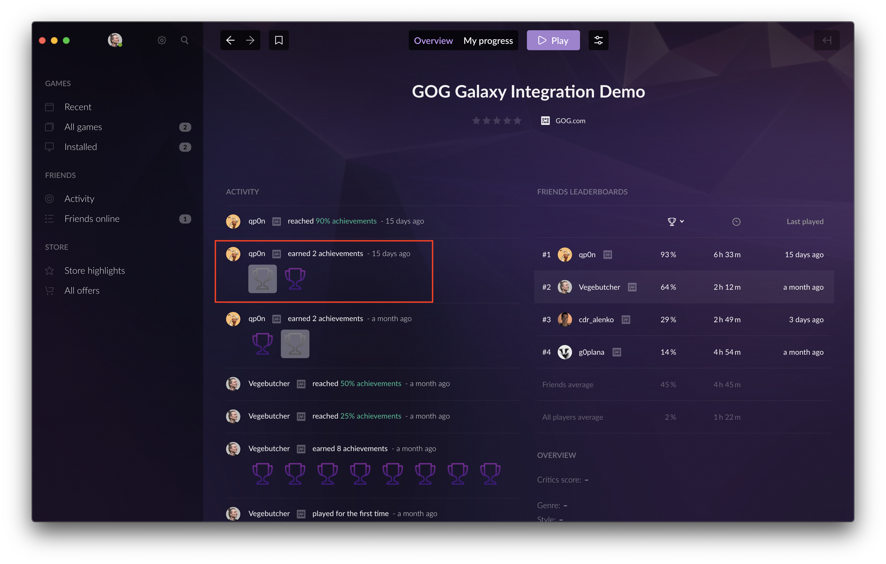

# Testing Your Games

This article will guide you through several testing scenarios for the GOG GALAXY SDK. Specifically, you’ll be able to test the initialization of the SDK, achievements, statistics and leaderboards.

The objective of the tests are as follows:

- To ensure that your game launches and functions correctly, irrespective of the GOG GALAXY status.
- To ensure that your game launches and functions correctly, irrespective of whether the user has a license for the game on their GOG account.
- To ensure that the GOG GALAXY supported achievements, statistics, leaderboards work as intended both with and without an internet connection.

## Getting Started

Before beginning your tests, it’s important to note that the GOG GALAXY SDK has [two statuses](sdk-galaxy-feats-and-states.md):

| Status     | Method to Check the Status                                   | Description                                                  |
| ---------- | ------------------------------------------------------------ | ------------------------------------------------------------ |
| `SignedIn` | [`galaxy::api::IUser::SignedIn()`](https://docs.gog.com/galaxyapi/classgalaxy_1_1api_1_1IUser.html#aa6c13795a19e7dae09674048394fc650) | Determines whether the user has a license for the game and is logged in to the GOG GALAXY client |
| `LoggedOn` | [`galaxy::api::IUser::IsLoggedOn()`](https://docs.gog.com/galaxyapi/classgalaxy_1_1api_1_1IUser.html#a3e373012e77fd2baf915062d9e0c05b3) | Determines if the user has a license for the game, is logged in to the GOG GALAXY client and is connected to the Internet |

Thus, GOG GALAXY features can work in two modes:

- **Online** (`SignedIn` == `true` and `LoggedOn` == `true`), and
- **Offline** (`SignedIn` == `true` and `LoggedOn` == `false`).

When `SignedIn` returns `false`, achievements, leaderboards, networking and matchmaking services should not be called.

**The DLC discovery feature should work regardless of the `SignedIn` and `LoggedOn` status** — it is only dependent on the [`Init()`](https://docs.gog.com/galaxyapi/group__Peer.html#ga7d13610789657b6aebe0ba0aa542196f) call, which should be called before the [DLC discovery](sdk-dlc-discovery.md) method.

To test all scenarios, you will need two GOG.com accounts: one with the game license and one without it.
To create a new account, go to the [GOG.com](https://www.gog.com/) main page, hover your mouse over *SIGN IN*, and select *CREATE ACCOUNT* from the drop-down menu. You will be asked to enter an account name, email address, and password. Please note that the provided email address will be used for a 2-step authentication. You can turn the 2-step login off in the [account security settings](https://www.gog.com/account/settings/security).

To receive the game license, you will need to log in to the [GOG.com Developer Portal](https://devportal.gog.com/). Every time you log in to the Developer Portal, your account will automatically be granted licenses for all games assigned to your company. You can read more about this in our [article on managing user accounts and licenses](game-licenses.md).

## Testing basic implementation: Init(), SignedIn(), IsLoggedOn()

| #    | Action                                                       | Expected Result                                              |
| ---- | ------------------------------------------------------------ | ------------------------------------------------------------ |
| 1.   | Uninstall GOG GALAXY client                                  |                                                              |
| 2.   | Start the game                                               | `SignedIn()` and `IsLoggedOn()` should return `false`        |
| 3.   | Play for five minutes and then exit the game                 |                                                              |
| 4.   | Install the GOG GALAXY client, but **do not log in**         |                                                              |
| 5.   | Start the game                                               | `SignedIn()` and `IsLoggedOn()` should return `false`        |
| 6.   | Play for five minutes and then exit the game                 |                                                              |
| 7.   | Log in to the GOG GALAXY client using the account without the game license |                                                              |
| 8.   | Start the game                                               | `SignedIn()` and `IsLoggedOn()` should return `false`        |
| 9.   | Play for five minutes and then exit the game                 |                                                              |
| 10.  | Log in to the GOG GALAXY client using the account with the game license |                                                              |
| 11.  | Start the game                                               | `SignedIn()` and `IsLoggedOn()` should return `true`         |
| 12.  | Play for five minutes and then exit the game                 |                                                              |
| 13.  | Turn your internet connection off; make sure that you are still logged in to GOG GALAXY |                                                              |
| 14.  | Start the game                                               | `SignedIn()` should return `true`, but `IsLoggedOn()`should return `false` |
| 15.  | Play for five minutes and exit the game                      |                                                              |

If during these steps you didn’t encounter any errors or crash, and each status is correct for the corresponding step, you have successfully implemented the GOG GALAXY SDK!

## Testing Achievements and Statistics

Achievements and statistics should work whenever your `SignedIn()` status returns `true` (in other words, when you’ve bought the game on your account and you’re logged in to the GOG GALAXY client — this is irrelevant of your online status).

To test this:

1. Log in to the GOG GALAXY client using the account with the game license. Make sure your internet connection is on.
2. Start the game, complete the requirements to unlock an achievement (make sure that it wasn’t already unlocked) and complete an action that should change a statistic.
3. Quit the game and check for the achievement in the GOG GALAXY client — it should be unlocked. The achievement should be visible regardless of the mode (development or production) that has been set for the achievements in the Developer Portal.
   
4. You can check the value of your statistic with the [`galaxy::api::IStats()::GetStatInt()`](https://docs.gog.com/galaxyapi/classgalaxy_1_1api_1_1IStats.html#a5a40b3ae1cd2d0cb0b8cf1f54bb8b759) or [`galaxy::api::IStats()::GetStatFloat()`](https://docs.gog.com/galaxyapi/classgalaxy_1_1api_1_1IStats.html#a4949fc4f78cf0292dca401f6411fab5b) methods, depending on the type of the statistic that was changed. You can output this value to a log or to the screen for debugging purposes.
5. Stay logged in to the GOG GALAXY client, turn off your internet connection and wait for 30 seconds.
6. Start the game, complete the requirements to unlock an achievement (make sure that it wasn’t already unlocked) and complete an action that should change a statistic.
7. Quit the game.
8. Turn your internet connection back on. The achievement should pop up in the client within a few seconds. If it doesn’t:
   - Start the game and play for five minutes; please refrain from an action that could unlock an achievement or affect a statistic.
   - Exit the game and check for the achievement in the GOG GALAXY client — it should be unlocked. As in the step #4, you can check the value of your statistic with the `galaxy::api::IStats()::GetStatInt()` or `galaxy::api::IStats()::GetStatFloat()` methods, depending on the type of statistic that was changed. You can output this value to a log or to the screen for debugging purposes.

## Testing Leaderboards

1. Log in to the GOG GALAXY client using the account with the game license. Make sure your internet connection is on.
2. Start the game and complete an action required to save your leaderboard score (done in game by calling [`galaxy::api::IStats()::SetLeaderboardScore()`](https://docs.gog.com/galaxyapi/classgalaxy_1_1api_1_1IStats.html#a95d5043fc61c941d882f0773225ace35)).
3. Open your leaderboards in game and look for the new entry that you’ve made. Leaderboards should be updated and the new entry should be visible.
4. Quit the game and turn your internet connection off.
5. Start the game and complete an action required to save your leaderboard score.
6. The game should not freeze or crash.
