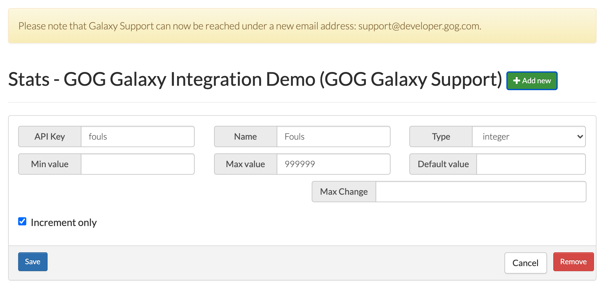
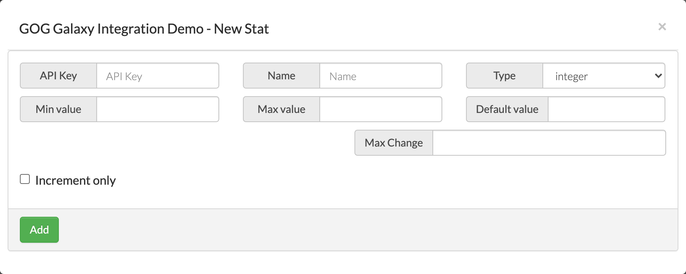

# Statistics Screen

This is the place in the Developer Portal for setting up and managing statistics implemented with the [GOG GALAXY SDK](sdk-stats-and-achievements.md) in your game. You can add new statistics or edit/remove existing ones.

## Adding a New Statistic

To add a new statistic:

1. Click the green *Add new* button.

2. In the resulting *New Stat* window, fill in the following fields:

    

    - *API Key* — a unique key used in your game source code; please note that it shouldn’t contain any special characters except dots (.) and underscores (_)
    - *Name* — the name of the statistic
    - *Type* — we support two types of statistic: **integer** and **float** (please note that each type has its own GOG GALAXY SDK `SetStat()` method)
    - *Min value* and *Max value* — with these fields you can set a range for a value of a statistic (the default minimum value is 0 and there is no maximum)
    - *Default value* — you can pass a value here, if you would like your statistic to have a default value other than 0
    - *Max Change* — sets a limit on the amount that a stat value can change from one update call to the next.
    
3. Decide on whether the value of a statistic should be *Increment only* — if you check this box, the value cannot be decreased and update calls with values lower than the current one will be ignored.

4. Click the green *Add* button.

## Editing an Existing Statistic

It’s done exactly as with adding a new statistic, only without steps #1 and #4, obviously, and on the main *Statistics* screen.
