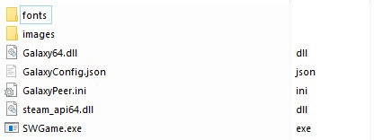
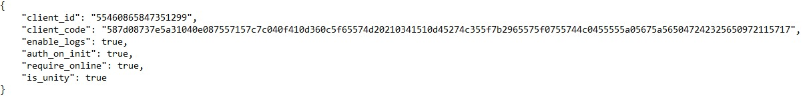

# SDK Wrapper (Beta)
**Keep in mind this project is a Work In Progress, with many features and improvements to come.<br>
Please leave your [feedback](https://forms.gle/3h2oULcDGaDsZKMdA).**

**SDK Wrapper is not endorsed or sponsored by Valve.**

**SDK Wrapper only supports Windows.**

## Introduction

As you know from [the previous article](https://docs.gog.com/gog-and-steam/), there are some essential differences between GOG and other platforms, including Steam. With this tool we aim to decrease the time needed to implement additional features on GOG if you already have a working Steam build (with other platforms planned for future development).  
If you already have a Steam version of your product (SDK Wrapper is intended to be used only after you have created your game's Steam build), you can get it up and running on our platform within minutes, not hours. No changes to the code need to be made — all you need is to use our SDK Wrapper (Beta).

**Galaxy SDK API is still available alongside SDK Wrapper functionality** so it's possible to create custom Galaxy SDK init but leave other functionality like stats or leaderboards to SDK Wrapper.

SDK Wrapper (Beta) is a middle layer that provides interoperability between Steam and GOG Galaxy API calls and speeds up the process of developing GOG builds by translating Steam API calls included in a build already created with Steam in mind into calls that can be understood by the GOG backends.  
Not all SDK features are supported yet — and, obviously, some will never be — but basic functionality is preserved. Currently, SDK Wrapper (Beta) allows to use the following features out of the box:

- achievements,
- leaderboards,
- stats,
- friends,
- matchmaking (lobbies, lobby data, lobby chat),
- cloud saves (Remote Storage),
- DLC detection (via `GalaxyConfig.json` mapping),
- game language (`ISteamApps::GetCurrentGameLanguage`),
- Steam Input → XInput mapping (partial; see [Input actions](#input-actions))

SDK Wrapper is not endorsed or sponsored by Valve.

## Offline mode

Games on GOG being DRM-free require that the game is playable even without Galaxy Client installed.
Therefore it should be possible to play the game even when `SteamAPI_Init` returns `false`, which isn't the case for Steam.  
It means that in order to ensure that your game and its online features work, **you need to either**:

- keep Galaxy Client running 

or 

- allow your game to be able to continue running when `SteamAPI_Init` returns `false` (which will result in disabling its online features).

When Galaxy Client is **not** installed, `init_always_true` defaults to `true` automatically so `SteamAPI_Init` can still return success and the game can run offline (online features remain unavailable until Galaxy is present). Set `init_always_true` explicitly in `GalaxyConfig.json` if you need that behavior when Galaxy Client is installed as well.

It's a special case that could imply game's code changes e.g. only replace `SteamAPI_Init` section with `galaxy::api::Init`.
This feature is still being discussed and worked on.

DLC Discovery and Storage interface's methods using local filesystem (`FileWrite`/`FileRead` etc.) are still available even without Galaxy Client running and authorization.

## Implementation

1. Make sure you're using a [supported Steam API version](#supported-steam-api-versions).
2. Add achievements to DevPortal, ideally using the [VDF file from Steam](https://docs.gog.com/sdk-steam-import/?h=vdf).
3. Download [SDK Wrapper (Beta)](https://devportal.gog.com/galaxy/components/steam_sdk_wrapper)  
   **Be advised: download the package that matches the Steamworks version your game was built with.** Packages are named `GalaxySteamWrapper_<version>_<32|64>bit_Steamworks<steam_version>.tar.gz`.
4. Add SDK Wrapper (Beta) to your game. There are two ways to achieve that. Do one of the following:
    - **Option a:** Rename `GalaxySteamWrapper/Libraries/GalaxySteamWrapper[64].dll` to `steam_api[64].dll` and use it to replace the original `steam_api[64].dll` file in your already built game.
    - **Option b:** Recompile your game linking against `GalaxySteamWrapper/Libraries/GalaxySteamWrapper[64].lib`.
5. Copy `GalaxySteamWrapper/Libraries/Galaxy[64].dll` to the same directory as `steam_api[64].dll` or executable, depending on how working directory and links are handled.
6. Create a [`GalaxyConfig.json`](#configuration-file) file where you specify `client_id` and either `client_secret` or `client_code`, and place it in the same directory as `steam_api[64].dll` (some exceptions may apply; see the Unity section below).
7. Your build (ideally no rebuild needed if you chose **4.a**) is now ready to be uploaded to DevPortal.

Example:

    Game folder

    

    GalaxyConfig.json

    

### Demo game

You can check our SDK Wrapper demo game and its source code for the exact implementation.
Ask our support for its license (1931358602 SDK Wrapper Demo Game).
[Check its source code on GitHub](https://github.com/gogcom/sdk-wrapper-demo-game) and build it yourself.

## Supported Steam API Versions

SDK Wrapper (Beta) can currently support only specific versions of the Steam API headers, and your game must be built with one of them.

| Scope | Versions |
| :---- | :------- |
| Unit-tested range | **1.29** – **1.64** |
| Game-tested | **1.29**, **1.42**, **1.62**, **1.64** |

The authoritative list of downloadable packages is on the [SDK Wrapper download page](https://devportal.gog.com/galaxy/components/steam_sdk_wrapper) on DevPortal. This documentation may lag behind newly added Steamworks versions.

SDK Wrapper releases are built against **Galaxy SDK 1.152.10**.

If your game already uses one of the supported versions, no action is necessary. Otherwise, support for other versions of the Steam API headers can be added to SDK Wrapper (Beta), or you may update your current pipeline (your existing build) or set up a new one with a different Steam API version.  
Whichever you choose, you can find the list of all Steamworks releases [here](https://partner.steamgames.com/downloads/).

## Configuration File

In order for SDK Wrapper (Beta) to know the [SDK credentials](https://docs.gog.com/bc-project-properties/#sdk-credentials) of your game, they must be specified in `GalaxyConfig.json` (you can obtain them in [Devportal](https://docs.gog.com/developer-portal/#games-screen-product-buttons)). It is a flat JSON file used for configurations which should be distributed along with the game and located in its working directory — usually where the EXE file is. The only required properties are `client_id` and either `client_secret` or `client_code`. The remaining [options](#available-options) are read and parsed during `SteamAPI_Init`.

### client_code

Plaintext `client_secret` can be used for testing purposes, but it is recommended to use `client_code` instead when releasing. `client_code` is an encrypted version of `client_secret`. You can obtain it by accessing SDK credentials in the [games menu](https://devportal.gog.com/panel/games).

### Minimal Config Example
```json
{
    "client_id": "XXXXXXXXXXXXXXXXX",
    "client_code": "YYYYYYYYYYYYYYYYYYYYYYYYYYYYYYYYYYYYYYYYYYYYYYYYYYYYYYYYYYYYYYYY"
}
```

### Available Options

| Option | Type | Default | Description |
| :----- | :--- | :------ | :---------- |
| `client_id` | string | required | ID of the client |
| `client_secret` | string | `""` | Secret of the client (**required** unless `client_code` is specified) |
| `client_code` | string | `""` | Code of the client (**required** unless `client_secret` is specified) |
| `config_file_path` | string | `"."` | Path to folder containing Galaxy configuration files |
| `storage_path` | string | `""` | Path to folder for storing internal SDK data |
| `host` | string | `""` | Local IP address this peer would bind to |
| `port` | number | `0` | Local port used for communication with servers and peers |
| `auth_on_init` | bool | `true` | `SteamAPI_Init` will attempt blocking `SignInGalaxy` |
| `require_online` | bool | `false` | Indicates if sign in with GOG Galaxy backend is required |
| `auth_timeout` | int | `15` | Timeout (seconds) for blocking `SignInGalaxy` |
| `stats_on_init` | bool | `false` | `SteamAPI_Init` will call `RequestCurrentStats` |
| `dlcs` | array | `[]` | DLC mappings between Steam and Galaxy IDs (see [DLC mapping](#dlc-mapping)) |
| `input_actions` | array | `[]` | Steam Input action-set mappings to XInput (see [Input actions](#input-actions)) |
| `steam_appid` | number | `100` | Steam AppID to use (`100` is the default mock ID) |
| `init_always_true` | bool | `true`¹ | Makes `SteamAPI_Init` return `true` even when Galaxy init or auth fails |
| `force_callbacks` | bool | `false` | Force callback dispatch on every `SteamAPI_RunCallbacks` call |
| `force_store_stats` | bool | `false` | Force stats to be stored after every stat write |
| `offline_persona` | bool | `false` | Helps to set the same save/profile path for both online and offline play |

¹ Defaults to `true` when Galaxy Client is not installed; otherwise defaults to `false` unless set explicitly.

### DLC mapping

The `dlcs` array maps Steam DLC AppIDs to their Galaxy counterparts so that `ISteamApps::BIsDlcInstalled`, `GetDLCCount`, and `BGetDLCDataByIndex` work correctly.

```json
{
    "dlcs": [
        { "steam_id": 1234560, "galaxy_id": 1234567890123456, "name": "My DLC" }
    ]
}
```

| field | type | description |
| :---- | :--- | :---------- |
| `steam_id` | number | Steam DLC AppId |
| `galaxy_id` | number | Galaxy product ID for the DLC |
| `name` | string | Human-readable name (used in logs) |

### Input actions

The `input_actions` array configures Steam Input → XInput button mapping when `ISteamInput` is active (Steamworks **1.43+**). Each entry in the array represents one action set and maps Steam action names to controller button identifiers. You must also ship `xinput1_3.dll` and `goginput.ini` beside the main DLL.

```json
{
    "input_actions": [
        {
            "dpad_up": "UP",
            "dpad_down": "DOWN",
            "dpad_left": "LEFT",
            "dpad_right": "RIGHT",
            "button_a": "A",
            "button_b": "B",
            "button_x": "X",
            "button_y": "Y",
            "l1": "L1",
            "r1": "R1",
            "l2": "L2",
            "r2": "R2",
            "back": "SELECT",
            "start": "START",
            "l3": "",
            "r3": "",
            "left_stick": "Move",
            "right_stick": ""
        }
    ]
}
```

## Galaxy Bridge API

In addition to the standard Steamworks ABI, `GalaxySteamWrapper.dll` exposes a small bridge API (`GalaxySteamWrapperApi.h`, included in every release package) that gives host applications direct access to the underlying Galaxy SDK without linking Galaxy separately.

### Lifecycle

```cpp
GalaxySteamWrapper_Init(clientID, clientSecret); // initialise Galaxy (alternative to SteamAPI_Init)
GalaxySteamWrapper_ProcessData();                // pump callbacks (call once per frame)
GalaxySteamWrapper_Shutdown();                   // clean up
const char* err = GalaxySteamWrapper_GetErrorMessage(); // retrieve last error string
```

### ID conversion

```cpp
CSteamID          steamID  = GalaxySteamWrapper_ToSteamID(galaxyID);
galaxy::api::GalaxyID gid  = GalaxySteamWrapper_ToGalaxyID(steamID);
```

### User / auth helpers

```cpp
bool signedIn = GalaxySteamWrapper_User_SignedIn();
bool online   = GalaxySteamWrapper_User_IsLoggedOn();
GalaxySteamWrapper_User_SignOut();

uint64_t realID = GalaxySteamWrapper_User_GetGalaxyID_GetRealID();
uint64_t id64   = GalaxySteamWrapper_User_GetGalaxyID_ToUint64();

const char* token = GalaxySteamWrapper_User_GetAccessToken();
const char* idTok = GalaxySteamWrapper_User_GetIDToken();
```

The header also exposes read-only user data accessors, session ID, and encrypted app ticket helpers. See `GalaxySteamWrapperApi.h` in the release package for the full list.

## Bindings to other programming languages

From Steamworks **1.32** onward, the flat API is supported, so projects like [Steamworks.NET](https://steamworks.github.io/) or [Facepunch.Steamworks](https://wiki.facepunch.com/steamworks/) **should** work without additional tinkering. The same applies to other projects that call `steam_api.dll` flat API exports.

CSteamworks is not currently supported.

### Manual Callback Dispatch

As of version 1.1.2 of SDK Wrapper, Steam's manual callback dispatch (instead of running all callbacks at once with `SteamAPI_RunCallbacks`, you can dispatch them manually with `SteamAPI_ManualDispatch`) is fully supported.  
Facepunch.Steamworks moved to using manual dispatch as of 2.3.0, so it should be possible to use this and later versions with SDK Wrapper.

### Game engines

| Game Engine | Notes |
| ----------- | ----- |
| `Unreal Engine` | Both native Steam implementation and EOS seem to work, but a little tinkering might be needed. |
| `Unity` | Appears to work without an issue |
| `Godot` | Appears to work without an issue |
| `Game Maker` | Appears to work without an issue |
| `RenPy` | Some issues regarding working directory/dll placement have been reported |

Most issues with bindings and game engines seem to be related to working directory, DLL, or EXE placement. We are working on a better approach regarding these issues.

## Unity

Depending on your Steamworks implementation (missing explicit `SteamStats()->RequestCurrentStats` call in Steamworks.NET, Facepunch) you might need to set `stats_on_init` flag in `GalaxyConfig.json` to `true` to fix achievements not working properly.

!!! Important
    Correct placement of the GalaxyConfig.json for Unity games is in the root folder of the game installation directory, next to the game.exe.

### Example placement of Wrapper files in the Unity game
```
.
├── root
│   └── gameTitle_data/
│       └── Plugins/
│           └── x86_64/
│               ├── Galaxy64.dll (new)
│               └── steam_api64.dll (replaced with renamed GalaxySteamWrapper64.dll)
├── GalaxyConfig.json
├── GalaxySteamWrapper.2021.09.28-09.33.33.log (example log file if logging is enabled)
└── game.exe
```

## Godot

If you are using GodotSteam you might need to set `stats_on_init` flag in `GalaxyConfig.json` to `true`.

## Unreal Engine

### Example placement of Wrapper files in the UE game
```
.
├── root
│   └── GameTitle/
│       └── Binaries/
│           └── Win64/ (working directory in UE4-built game)
│               ├── GameTitle-Win64-Shipping.exe
│               ├── GalaxyConfig.json (new)
│               └── GalaxySteamWrapper.2021.09.28-09.33.33.log (example log file if logging is enabled)
└── Engine/
    └── Binaries/
        └── ThirdParty/
            └── Steamworks/
                └── Steamv139/ (number may differ if the game uses a different Steamworks version)
                    └── Win64/
                        ├── Galaxy64.dll (new)
                        └── steam_api64.dll (replaced with renamed GalaxySteamWrapper64.dll)

```
Depending on your Steamworks implementation some changes to Unreal Engine itself might be needed.

### Native C++

If your Steam implementation is in native C++, it should work like any other game so the default drag & drop method mentioned above should suffice.  

### EOS

When using EOS Online Subsystem Steam and blueprints some changes to the engine itself need to be made.  
First you need to check which Steamworks version your version of UE supports here: `/YourUnrealEnginePath/Engine/Source/ThirdParty/Steamworks/` and `Steamworks.build.cs`. For UE 4.27 it's Steamv151 so please stick to this version.

Online Subsystem is a private dependency so by default it is statically linked into your project using `steam_api[64].dll` shipped with the engine thus recompilation is necessary.  

This implies drag-and-dropping `GalaxySteamWrapper[64].dll` and `Galaxy[64].dll` e.g. here `/YourUnrealEnginePath/Engine/Binaries/ThirdParty/Steamworks/Steam[Current Version]/Win64` replacing the original `steam_api[64].dll` and then recompiling your project.  

After recompilation, please make sure to ship your package with `GalaxyConfig.json` placed in `YourPackage/YourProject/Binaries/Win[64]` beside your game's executable file and `Galaxy[64].dll` in `YourPackage/Engine/Binaries/ThirdParty/Steamworks/Steam[Current Version]`.

### Writing achievements fails (UE4)

Check exactly how achievements are defined in the OSS configuration file in the engine. In case of Nemezis: Mysterious Journey III, achievements were declared in polish-style quotes (“NMJ_FIRST_PUZZLE” instead of "NMJ_FIRST_PUZZLE"). Steamworks offers some support against this; Steam Wrapper does not.

## Example placement of Wrapper files in the Misc engine
```
.
├── root
├── Galaxy64.dll (new)
├── GalaxyConfig.json (new)
├── GalaxySteamWrapper.2021.09.28-09.33.33.log (example log file if logging is enabled)
├── Game.exe
└── steam_api.dll (replaced with renamed GalaxySteamWrapper.dll)
```

## Methods Implemented

**Note:** Unlisted methods are not implemented (or return safe stub values).

### SteamClient Interface

| Method | Supported | Remarks |
| ------ | --------- | ------- |
| `SetWarningMessageHook` | Yes | Does the same as `SteamUtils::SetWarningMessageHook`: outputs GOG Galaxy error messages |

### SteamApps Interface

| Method | Supported | Remarks |
| ------ | --------- | ------- |
| `BIsSubscribed` | Yes | Always returns `true` |
| `GetCurrentGameLanguage` | Yes | Mapped from Galaxy language codes |
| `GetAvailableGameLanguages` | Simplified | Returns current language only |
| `BIsSubscribedApp` | Yes | Always returns `true` |
| `BIsDlcInstalled` | Yes | Requires DLC entry in `GalaxyConfig.json` |
| `GetDLCCount` | Yes | Based on `dlcs` config entries |
| `BGetDLCDataByIndex` | Yes | Based on `dlcs` config entries |
| Other `ISteamApps` methods | No | Return stub values |

### SteamMatchmaking Interface

| Method | Supported | Remarks |
| ------ | --------- | ------- |
| `RequestLobbyList` | Yes | Does not auto-request data for each lobby; call `RequestLobbyData` per lobby if needed |
| `AddRequestLobbyListStringFilter` | Yes | |
| `AddRequestLobbyListNumericalFilter` | Yes | |
| `AddRequestLobbyListNearValueFilter` | Yes | |
| `AddRequestLobbyListFilterSlotsAvailable` | No | |
| `AddRequestLobbyListDistanceFilter` | No | |
| `AddRequestLobbyListResultCountFilter` | No | |
| `AddRequestLobbyListCompatibleMembersFilter` | No | |
| `GetLobbyByIndex` | Yes | |
| `CreateLobby` | Yes | |
| `JoinLobby` | Yes | |
| `LeaveLobby` | Yes | |
| `InviteUserToLobby` | Yes | Uses Galaxy friend invitations |
| `GetNumLobbyMembers` | Yes | |
| `GetLobbyMemberByIndex` | Yes | |
| `GetLobbyData` | Yes | |
| `SetLobbyData` | Yes | |
| `GetLobbyDataCount` | Yes | |
| `GetLobbyDataByIndex` | Yes | |
| `DeleteLobbyData` | Yes | |
| `GetLobbyMemberData` | Yes | |
| `SetLobbyMemberData` | Yes | |
| `SendLobbyChatMsg` | Yes | |
| `GetLobbyChatEntry` | Yes | |
| `RequestLobbyData` | Yes | |
| `SetLobbyGameServer` | No | Logged only |
| `GetLobbyGameServer` | No | |
| `SetLobbyMemberLimit` | Yes | |
| `GetLobbyMemberLimit` | Yes | |
| `SetLobbyType` | Yes | |
| `SetLobbyJoinable` | Yes | |
| `GetLobbyOwner` | Yes | |
| `SetLobbyOwner` | Yes | |
| `SetLinkedLobby` | Yes | |
| Favorite games / server list APIs | No | |
| `ISteamMatchmakingServers` | No | |
| `ISteamParties` / `ISteamGameSearch` | No | |

### SteamRemoteStorage Interface

| Method | Supported | Remarks |
| ------ | --------- | ------- |
| `FileExists` | Yes | |
| `FileRead` | Yes | |
| `FileWrite` | Partially | No checking for reaching file limits or invalid paths/filenames |
| `GetFileCount` | Yes | |
| `GetFileSize` | Yes | |
| `GetQuota` | No | |

### SteamUser Interface

| Method | Supported | Remarks |
| ------ | --------- | ------- |
| `BLoggedOn` | Yes | |
| `RequestEncryptedAppTicket` | Yes | |

### SteamUserStats Interface

| Method | Supported | Remarks |
| ------ | --------- | ------- |
| `RequestCurrentStats` | Yes | |
| `GetStat (integer)` | Yes | |
| `GetStat (float)` | Yes | |
| `SetStat (integer)` | Yes | |
| `SetStat (float)` | Yes | |
| `UpdateAvgRateStat` | Yes | |
| `GetAchievement` | Yes | |
| `SetAchievement` | Yes | |
| `ClearAchievements` | Yes | |
| `GetAchievementAndUnlockTime` | Yes | |
| `StoreStats` | Yes | |
| `GetAchievementDisplayAttribute` | Yes | |
| `FindOrCreateLeaderboard` | Yes | |
| `FindLeaderboard` | Yes | |
| `GetLeaderboardName` | Yes | |
| `GetLeaderboardEntryCount` | Yes | |
| `GetLeaderboardSortMethod` | Yes | |
| `GetLeaderboardDisplayType` | Yes | |
| `DownloadLeaderboardEntries` | Yes | Cannot be called with `k_ELeaderboardDataRequestUsers`, as in Steam |
| `DownloadLeaderboardEntriesForUsers` | Yes | |
| `GetDownloadedLeaderboardEntry` | Yes | |
| `UploadLeaderboardScore` | Yes | |

### SteamUtils Interface

| Method | Supported | Remarks |
| :----- | :-------- | :---------- |
| `SetWarningMessageHook` | Yes | Does the same as `SteamClient::SetWarningMessageHook`: outputs GOG Galaxy error messages |
| `GetAppID` | Yes | Uses `steam_appid` from config when set |

### SteamFriends Interface

| Method | Supported | Remarks |
| ------ | --------- | ------- |
| `GetClanActivityCounts` | No | Always sets arguments to 0 |
| `GetFriendsGroupName` | Simplified | Assumes everybody is in a single group, always returns `Friends`. |
| `GetFriendPersonaNameHistory` | Simplified | Assumes no history exists |
| `GetPlayerNickname` | Simplified | Assumes no nickname is set |
| `GetFriendsGroupCount` | Simplified | Groups are not supported; assumes everybody is in a single group |
| `GetFriendCount` | Partially | In the friend flags passed to this method, only `k_EFriendFlagImmediate` is supported |
| `GetFriendByIndex` | Partially | In the friend flags passed to this method, only `k_EFriendFlagImmediate` is supported |
| `HasFriend` | Partially | In the friend flags passed to this method, only `k_EFriendFlagImmediate` is supported |
| `SetRichPresence` | Partially | No custom keys; only `status`, `metadata` and `connect` allowed |
| `GetFriendRichPresence` | Partially | No custom keys; only `status`, `metadata` and `connect` allowed |
| `GetFriendSteamLevel` | No | Returns `0` |
| `GetClanCount` | Simplified | Returns `0` |
| `GetFriendsGroupMembersCount` | Partially | Returns friend count regardless of a group |
| `GetFriendsGroupMembersList` | Partially | Returns friend list regardless of a group |
| `GetFriendRelationship` | Partially | Returns only `k_EFriendRelationshipFriend` or `k_EFriendRelationshipNone` |
| `GetPersonaState` | Partially | Returns only `k_EPersonaStateOnline` or `k_EPersonaStateOffline` |
| `GetFriendPersonaState` | Partially | Returns only `k_EPersonaStateOnline` or `k_EPersonaStateOffline` |
| `GetUserRestrictions` | Partially | Returns only `k_nUserRestrictionNone` or `k_nUserRestrictionUnknown` |
| `GetPersonaName` | Yes | |
| `SetPersonaName` | No | |
| `GetFriendPersonaName` | Yes | |
| `GetFriendGamePlayed` | No | |
| `GetFriendsGroupIDByIndex` | No | |
| `GetClanByIndex` | No | |
| `GetClanName` | No | |
| `GetClanTag` | No | |
| `DownloadClanActivityCounts` | No | |
| `SetInGameVoiceSpeaking` | No | |
| `SetPlayedWith` | No | |
| `GetSmallFriendAvatar` | Yes | |
| `GetMediumFriendAvatar` | Yes | |
| `GetLargeFriendAvatar` | Yes | |
| `RequestUserInformation` | Yes | |
| `RequestClanOfficerList` | No | |
| `GetClanOwner` | No | |
| `GetClanOfficerCount` | No | |
| `GetClanOfficerByIndex` | No | |
| `ClearRichPresence` | Yes | |
| `GetFriendRichPresenceKeyCount` | Yes | |
| `GetFriendRichPresenceKeyByIndex` | Yes | |
| `RequestFriendRichPresence` | Yes | |
| `GetCoplayFriendCount` | No | |
| `GetCoplayFriend` | No | |
| `GetFriendCoplayTime` | No | |
| `GetFriendCoplayGame` | No | |
| `GetFollowerCount` | No | |
| `IsFollowing` | No | |
| `EnumerateFollowingList` | No | |
| `IsClanPublic` | No | |
| `IsClanOfficialGameGroup` | No | |

### Flat API

From Steamworks **1.32** onward, flat API functions shipped with Steamworks are supported with some exceptions. The following flat exports are stubs (they log and return empty/default values) because they depend on Steam-private behavior or unsupported platforms:

| Method |
| ------ |
| `DestructISteamHTMLSurface` |
| `RequestPublisherOwnedAppData` (Steam ≤ 1.36) |
| `GetPublisherOwnedAppData` (Steam ≤ 1.36) |
| `Set_SteamAPI_CPostAPIResultInProcess` (Steam ≤ 1.36) |
| `Remove_SteamAPI_CPostAPIResultInProcess` (Steam ≤ 1.36) |
| `RunFrame` |
| `Set_SteamAPI_CCheckCallbackRegisteredInProcess` |
| `SetXboxPairwiseID` |
| `GetXboxPairwiseID` |
| `SetPSNID` |
| `GetPSNID` |
| `SetStadiaID` |
| `GetStadiaID` |
| `ShowModalGamepadTextInput` |
| `GetConfigValueInfo` (Steam 1.52) |
| `IterateGenericEditableConfigValues` (Steam 1.52) |
| `ResetIdentity` (Steam 1.52) |
| `SetIPv4Addr` (Steam 1.53) |
| `GetFakeIPType` (Steam 1.53) |
| `GetIPv4` (Steam 1.53) |
| `IsFakeIP` (Steam 1.53) |

Also **SteamTV** and **SteamVR** flat interfaces are not supported.

**Keep in mind this project is a Work In Progress, with many features and improvements to come.<br>
Please leave your [feedback](https://forms.gle/3h2oULcDGaDsZKMdA).**

**SDK Wrapper is not endorsed or sponsored by Valve.**
