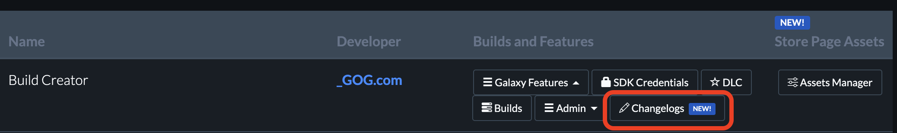
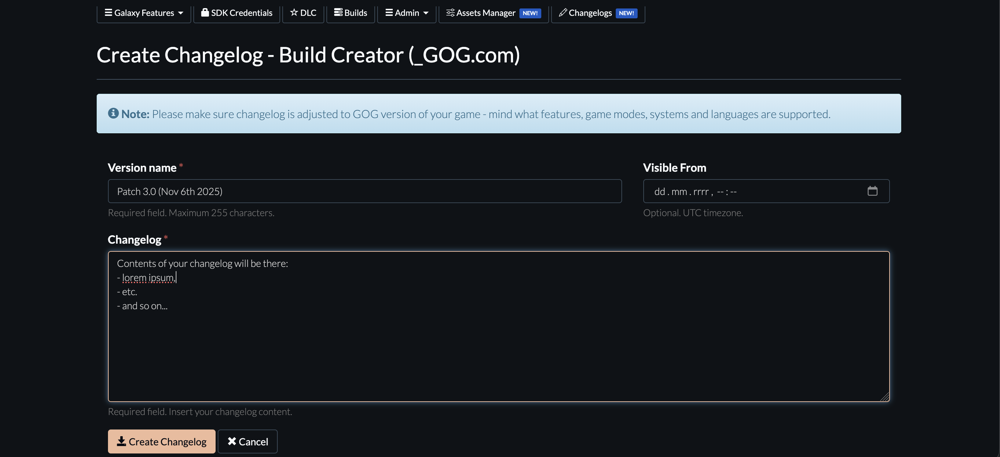
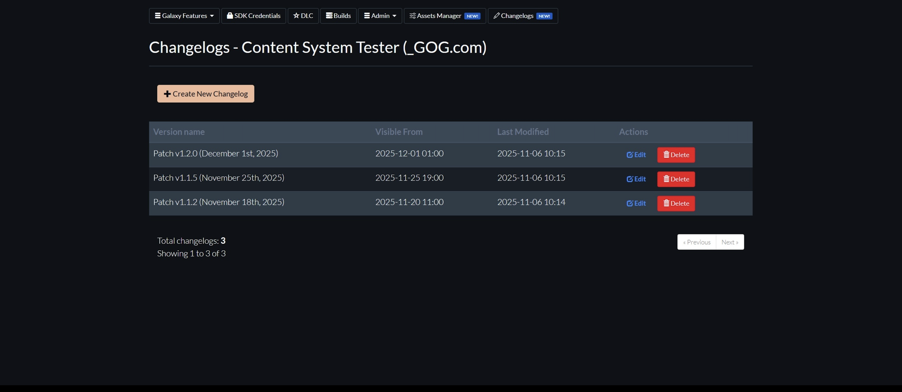

# Updates

After your game is released on GOG, please feel free to publish any stable updates to the Master branch as soon as they are ready without waiting for us to check the update. The pipeline is yours — do what you wish with it.

!!! Important
    We kindly request that you **do not unpublish any previous updates** that have been published on the Master branch. This allows users to make use of the [rollback feature](gc-rollback.md) in the [GOG GALAXY client](gc-client-overview.md) in case an update that has been published on the Master branch turns out to have been either prematurely published or exhibits major game-breaking bugs.

## Changelog - where to find it?

The changelog is visible in two places:

1. On the GOG.com website when a user clicks a game on their game shelf and then clicks *More⟶Changelog*:

    

2. In the game view in the GOG GALAXY client when a user selects a game in *Owned games*, clicks the *More* icon and selects *View patch notes* from the drop-down menu:

    

## Managing changelogs

The GOG DevPortal has a dedicated system for managing game changelogs, providing you with full, direct control over your patch notes.

Key features of this system:

- **Decoupled from Builds**: Changelogs are not tied to specific game builds. You must create them as a separate step.
- **Full Publishing Control**: You have direct control over publishing changelogs without needing to email the GOG team or wait for manual processing.
- **Instant or Scheduled Publishing**: Changelogs are published automatically. You can make them visible immediately or schedule them for a specific future date and time.

## How to Access the Changelog Panel

You can find the "Changelogs" tab in your game’s main panel in the DevPortal, alongside other settings like "Builds" and "SDK Settings".

## How to Add a New Changelog

When you upload a new version of your game, you must manually create a changelog entry to inform users of the updates.

1. Navigate to the **"Changelogs"** tab for your game.
2. Click the **"Create New Changelog"** button at the top of the page.
3. Fill in the required fields.
4. Click **"Create Changelog"** to create the entry.

### Understanding the Fields

- **Version name**: This is the title for your changelog entry.

!!! Important
    We highly recommend including both the version number and the release date in this field for maximum clarity, e.g., Patch 1.04 (July 28, 2025).

- **Visible From:** This field gives you precise control over when the changelog becomes public.
    - **To publish immediately**: Set the date and time to the current time or any time in the past.
    - **To schedule for the future**: Set the exact date and time you want the changelog to appear for users. It will be published automatically.
- **Changelog**: This is the main body of your patch notes. Enter the full text detailing all changes, fixes, and new features in this version. Please make sure changelog is adjusted to the GOG version of your game - mind what features, game modes, systems and languages are supported.

## Managing Existing Changelogs

The "Changelogs" tab displays a list of all current and past entries for your game.

- **Editing**: You can edit any existing changelog by clicking the "pencil" icon next to it.
- **Deleting**: You can permanently remove a changelog by clicking the "trash" icon.
- **Order**: Please note that **you cannot change the display order** of changelog entries. They are listed chronologically based on their creation.

## Guidelines and Best Practices

To ensure a high-quality and consistent experience for users, please follow these guidelines:

- **Maintain Consistency**: Use a consistent style for all your entries. This includes using a uniform date format, clear titling (e.g., "Patch 1.1," "Hotfix 1.1.2"), and similar text formatting for lists and headings.
- **Provide GOG-Specific Information**: Ensure your patch notes accurately reflect the features, game modes, supported systems, and languages available in the specific version released on GOG.
- **Avoid Cross-Platform References**: Your changelogs must not include any references to other platforms, stores, or platform-specific features (e.g., "Fixed an issue with Steam achievements"). Please review your entries carefully to remove all such references.

## Support

If you have any questions about the changelog system, please contact your dedicated Release Specialist. If you do not have one, feel free to contact our [Product team](https://devportal.gog.com/support/contact).