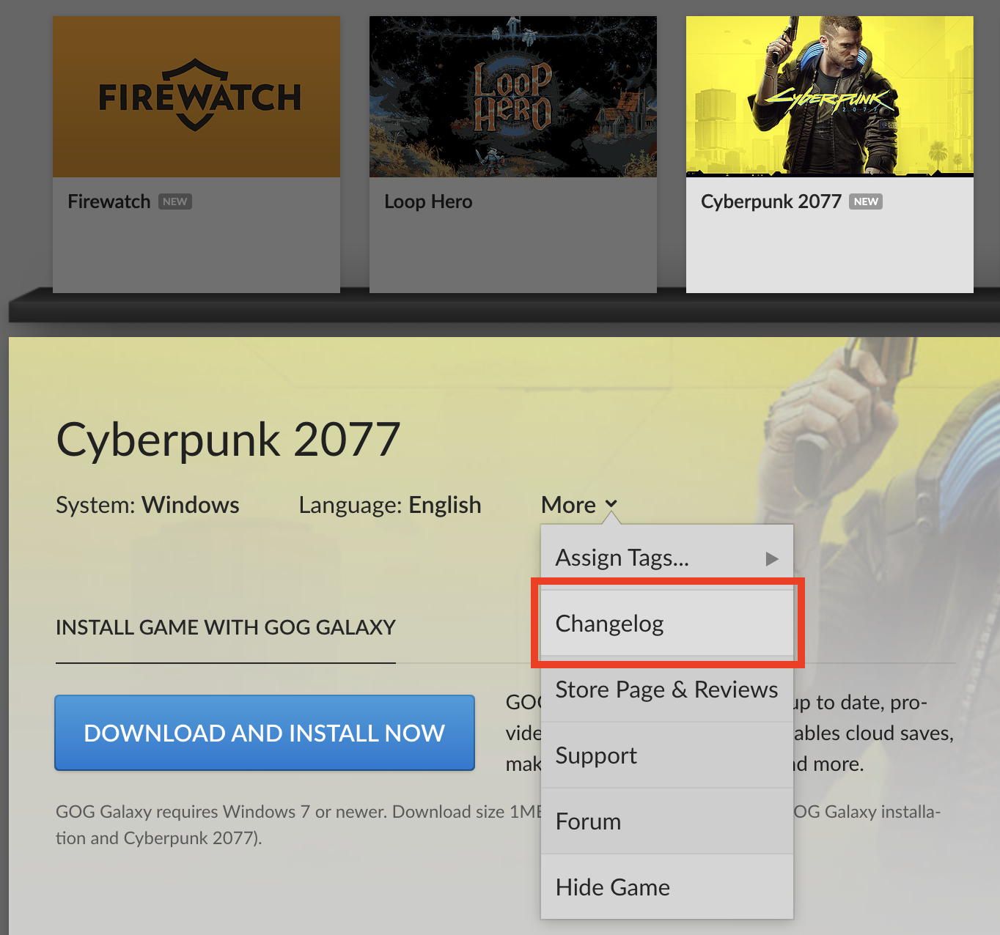
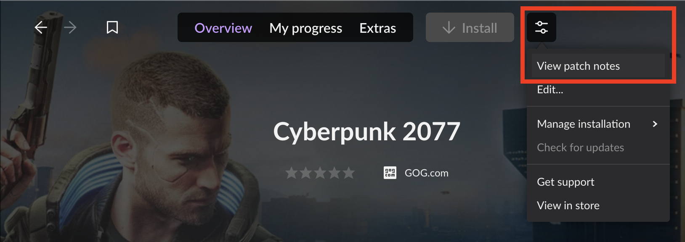
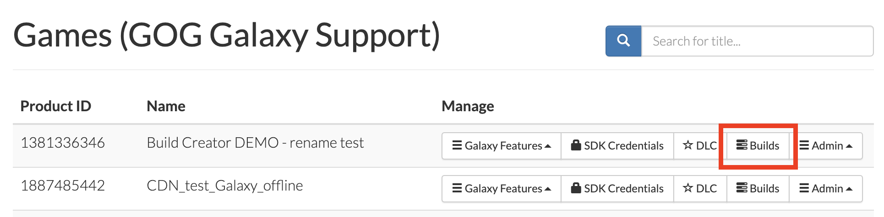
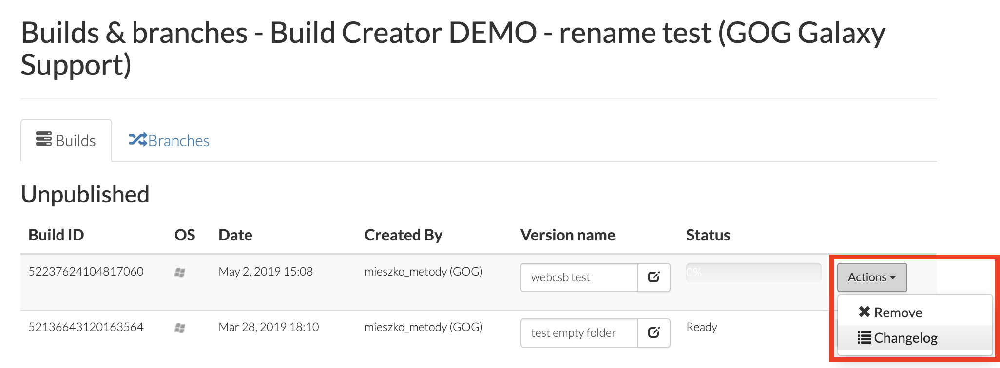

# Updates

After your game is released on GOG, please feel free to publish any stable updates to the Master branch as soon as they are ready without waiting for us to check the update. The pipeline is yours — do what you wish with it.

!!! Important
    We kindly request that you **do not unpublish any previous updates** that have been published on the Master branch. This allows users to make use of the [rollback feature](gc-rollback.md) in the [GOG GALAXY client](gc-client-overview.md) in case an update that has been published on the Master branch turns out to have been either prematurely published or exhibits major game-breaking bugs.

## Adding a Changelog

The changelog is visible in two places:

1. On the GOG.com website when a user clicks a game on their game shelf and then clicks *More⟶Changelog*:

    

2. In the game view in the GOG GALAXY client when a user selects a game in *Owned games*, clicks the *More* icon and selects *View patch notes* from the drop-down menu:

    

 If you want to add a changelog to your updated build, please follow these steps:

1. Log in to the Developer Portal and go to the *[Games](https://devportal.gog.com/panel/games)* page.

2. Click the *Builds* button for the desired game:

    

3. On the *Builds* tab of the *Builds & Branches* page that will be displayed, click the *Actions* button for the build you want to create a changelog for and select *Changelog* from the list:

    

4. On the resulting page, click the green *+Create changelog* button and use the displayed Markdown editor to compose your changelog.

5. Click *Save* when it’s ready.

You can also post the changelog directly on the dedicated GOG forum for your game.
