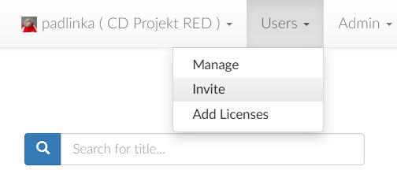
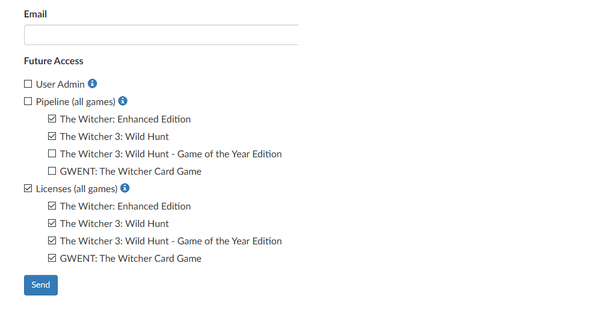
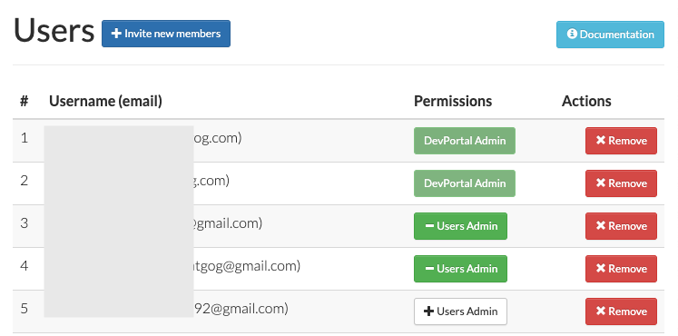
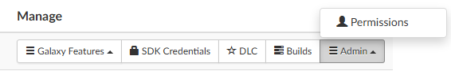
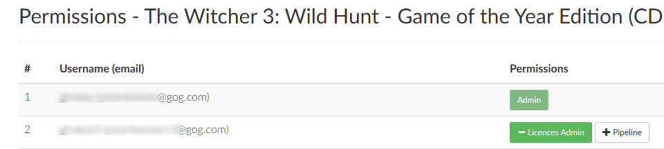

# User Management

If you are a User Admin, you can invite other users to the developer account displayed in parentheses next to your username.

If this developer account has more than one game assigned to it, you can invite users while granting them access only to specific games:

By default, User Admins will have access to all roles on all games. They also have the ability to manage users and invite new ones.

*Users→Manage* will let you grant the status of a User Admin to already invited users, changing their role for all games assigned to the developer account:

 

You can manage permissions per game in the *Games* view:

Here you can manage the pipeline and licenses access of already invited users and change them individually for each game on the developer account:

 

All users that previously had pipeline access (access to GOG tools for releasing a game), will now have pipeline access to all games on the developer account.

